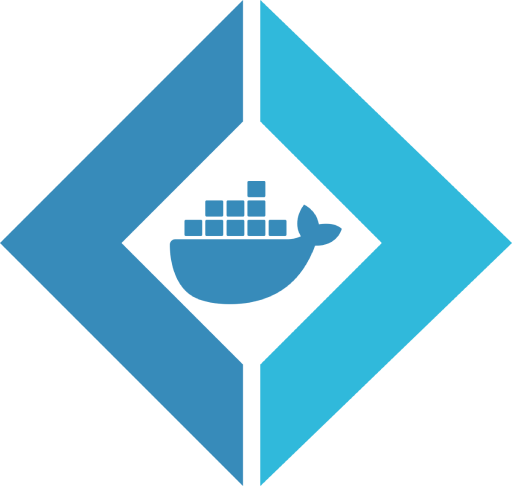

<!--suppress HtmlDeprecatedAttribute -->


# Tuffenuff

[](LICENSE)
[](https://github.com/blbrdv/Tuffenuff/actions?query=branch%3Arelease)
[](https://www.nuget.org/packages/Tuffenuff/)

Simple F# DSL for generating dockerfiles.

### Why?

1. To work with more flexing scripts and ability to reuse Dockerfile code.
2. Because I can.

## Usage

### Hello, World!

```f#
#r "nuget: Tuffenuff"

open System.IO
open Tuffenuff

df [
    !/ "Simple Hello World dockerfile"
    from "alpine:3.18"
    cmd [| "echo" ; "'Hello world'" |]
]
|> render
|> toFile (Path.Combine(__SOURCE_DIRECTORY__, "Dockerfile"))
```

will create `Dockerfile` with following content:

```Dockerfile
# Simple Hello World dockerfile
FROM alpine:3.18

CMD [ "echo", "'Hello world'" ]
```

### More complex example

#### foo.fsx

```f#
#r "nuget: Tuffenuff"

open Tuffenuff
open Tuffenuff.DSL

let echoMaessage () =
    df [
        !/ "this is from 'foo.fsx'"
        !> """echo 'echo "Shalom!"' > /etc/profile.d/welcome.sh"""
    ]
```

#### Dockerfile.part

```Dockerfile
# this is from 'Dockerfile.part'
ENTRYPOINT [ "/bin/bash", "-l" ]
```

#### bar.fsx

```f#
#r "nuget: Tuffenuff"
#load "foo.fsx"

open System.IO
open Tuffenuff
open Tuffenuff.DSL
open foo

let part1 = echoMaessage ()

let part2 =
    Dockerfile.fromFile (Path.Combine (__SOURCE_DIRECTORY__, "Dockerfile.part"))

df [
    !/ "Partial dockerfile"
    from "ubuntu:latest"
    !&part1
    !&part2
]
|> Dockerfile.render
|> Dockerfile.toFile (Path.Combine (__SOURCE_DIRECTORY__, "Dockerfile.Partial"))

```

will create `Dockerfile` with following content:

```Dockerfile
# Partial dockerfile
FROM ubuntu:latest

# this is from 'foo.fsx'
RUN \
    echo 'echo "Shalom!"' > /etc/profile.d/welcome.sh

# this is from 'Dockerfile.part'
ENTRYPOINT [ "/bin/bash", "-l" ]
```

### More examples

See [examples](examples).

## Local development

1. Install DotNet SDK version [8.0.x](https://dotnet.microsoft.com/download/dotnet/8.0)
2. Run `dotnet tool restore`
3. Use automation script for building/testing project and more.

See [script documentation](RUN.md) for more info.
